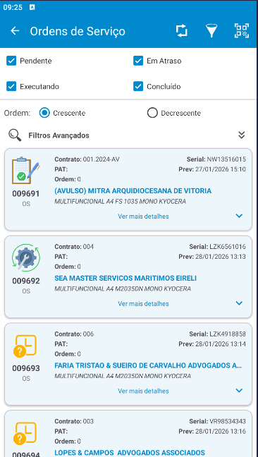
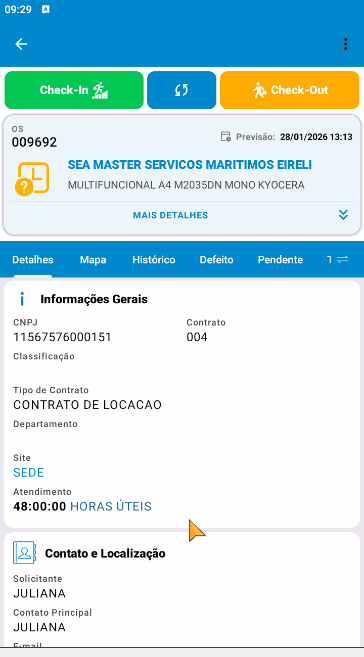

# DataMobile - Sistema de Gestão de Ordens de Serviço e análise de outsourcing.

> **Modernização de Software Legado:** Reestruturação de aplicativo Android nativo com foco em Material Design 3 e otimização de performance.

## 📱 Sobre o Projeto
O **DataMobile** é uma aplicação corporativa robusta voltada para técnicos de campo. O sistema permite a gestão detalhada de manutenções e ordens de serviço através de uma arquitetura **Offline-First**, garantindo que o fluxo de trabalho não seja interrompido por falta de conectividade.

<table border="0">
  <tr>
    <td>
      
    </td>
    <td>
      
    </td>
    <td>
      
    </td>
  </tr>
  <tr>
    <td align="center"><b>Acesso e Segurança</b></td>
    <td align="center"><b>Gestão de O.S.</b></td>
    <td align="center"><b>Fluxo de Check-in</b></td>
  </tr>
</table>

  <em>Visualização da interface modernizada: Login, Detalhes de OS e Sincronização de Check-in em tempo real.</em>

---

### 🛠 Tecnologias e Práticas Utilizadas
* **Android Nativo (Java):** Interface moderna com Material Design 3 e AndroidX.
* **Consumo de API REST:** Integração com backend em Delphi.
* **Sincronização Inteligente:** Algoritmo para evitar redundância de dados e tratamento de erros de rede.
* **Localização Geográfica:** Rastreamento e registro de coordenadas para ordens de serviço.
* **Arquitetura:** Aplicação de padrões como DAO (Data Access Object) e Singleton.
